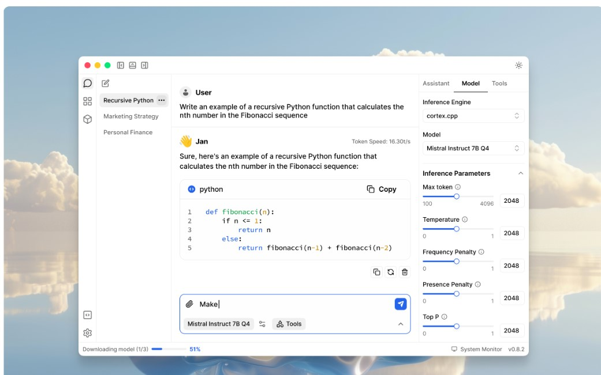

As developers, we're always on the lookout for powerful, accessible AI models that we can run locally. Google's Gemma 2B has emerged as an exciting option, offering a balance of performance and efficiency. In this guide, we'll walk you through the process of getting Gemma 2B up and running on your laptop using Jan AI, an impressive open-source platform that's changing the game for local AI deployment.

## Why Jan AI?

Before we dive into the setup, let's talk about why we're using Jan AI. As developers, we appreciate tools that are versatile, efficient, and easy to use. Jan AI ticks all these boxes:

1. **100% Offline Operation**: Run your AI models without internet connectivity – perfect for sensitive data or offline environments.
2. **Universal Architecture Support**: From NVIDIA GPUs to Apple M-series chips, Jan AI has you covered.
3. **User-Friendly Interface**: Simplifies the process of managing and running various AI models.
4. **Open-Source**: Benefit from community contributions and the ability to customize as needed.

## Step 1: Setting Up Jan AI

Getting started with Jan AI is straightforward:

1. Head over to [https://jan.ai/](https://jan.ai/).
2. Download the appropriate package for your operating system.
3. Follow the installation prompts to get Jan AI set up on your machine.

[Developer Note: Consider adding a screenshot of the Jan AI download page here]

## Step 2: Downloading Gemma 2B

Once Jan AI is installed, it's time to get our hands on Gemma 2B:

1. Launch Jan AI and navigate to the "Explore" section.
2. Use the search function to find "Gemma 2B".
3. Before you hit that download button, take note of the system compatibility information Jan AI provides:

   - **File Size**: Crucial for managing your storage.
   - **Performance Indicators**: Jan AI will let you know if the model might run slowly on your device.
   - **RAM Requirements**: Ensure your system has enough memory to handle the model.

4. If your system meets the requirements, go ahead and download Gemma 2B.

## Step 3: Running Gemma 2B

Now for the moment of truth – running Gemma 2B:

1. In Jan AI, click on the "Chat" section.
2. Look for the model selection dropdown.
3. Choose "Gemma 2B" from the list.
4. Start chatting! Your local instance of Gemma 2B is now ready to process your prompts.

## Developer Insights

As you start working with Gemma 2B, keep these tips in mind:

1. **Prompt Engineering**: Gemma 2B, like all language models, responds best to clear, well-structured prompts. Experiment with different phrasings to optimize your results.

2. **Performance Tuning**: If you're running on a less powerful machine, consider tweaking Jan AI's settings for better performance. Look for options to adjust the model's precision or inference settings.

3. **Offline Capabilities**: Leverage Gemma 2B's offline nature for projects involving sensitive data or for developing apps that need to function without internet connectivity.

4. **API Integration**: While we've focused on the chat interface, explore Jan AI's API options to integrate Gemma 2B into your applications programmatically.

5. **Model Comparison**: Jan AI makes it easy to switch between models. Consider comparing Gemma 2B's performance with other models for your specific use cases.

## Conclusion

Running Google Gemma 2B locally with Jan AI opens up a world of possibilities for developers. Whether you're building the next revolutionary chatbot, working on NLP projects, or simply exploring the capabilities of AI, this setup provides a powerful, flexible foundation.

Remember, the field of AI is rapidly evolving. Keep an eye on Jan AI's updates and the broader AI community for new models and features that could enhance your development workflow.

Happy coding, and enjoy exploring the capabilities of Gemma 2B right on your laptop!